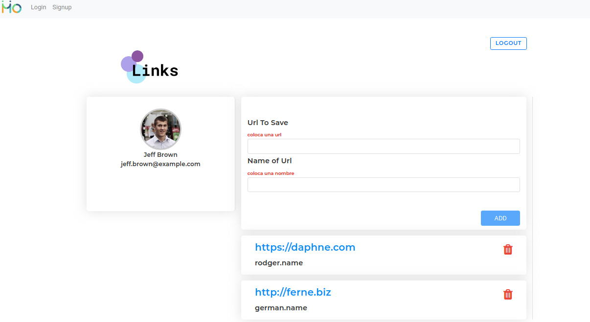

# LinksAngular

This project contains the visual layer of the scope of the exercise, here you as a user You can login, register and add links from your profile

## Build Project

`npm install`
## Run Project

`ng serve`

# visual presentation

you could run the frontend side in the url `http://localhost:4200/`